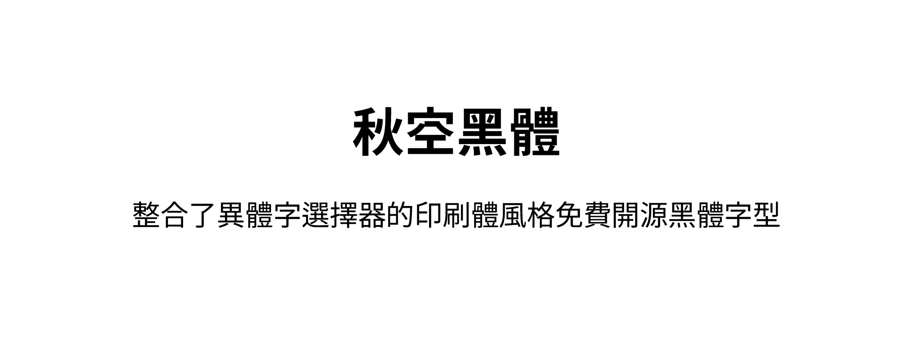
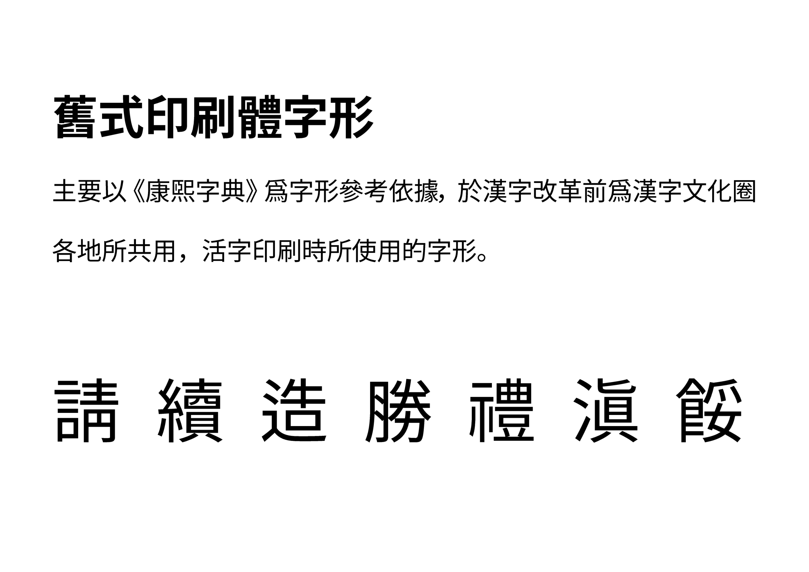
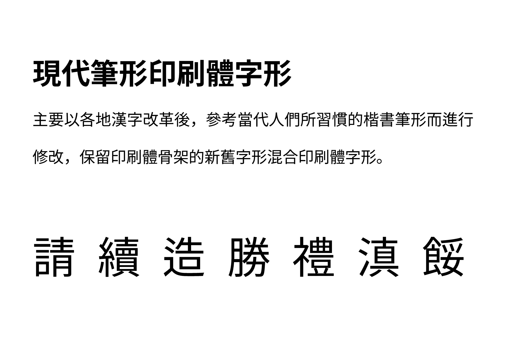
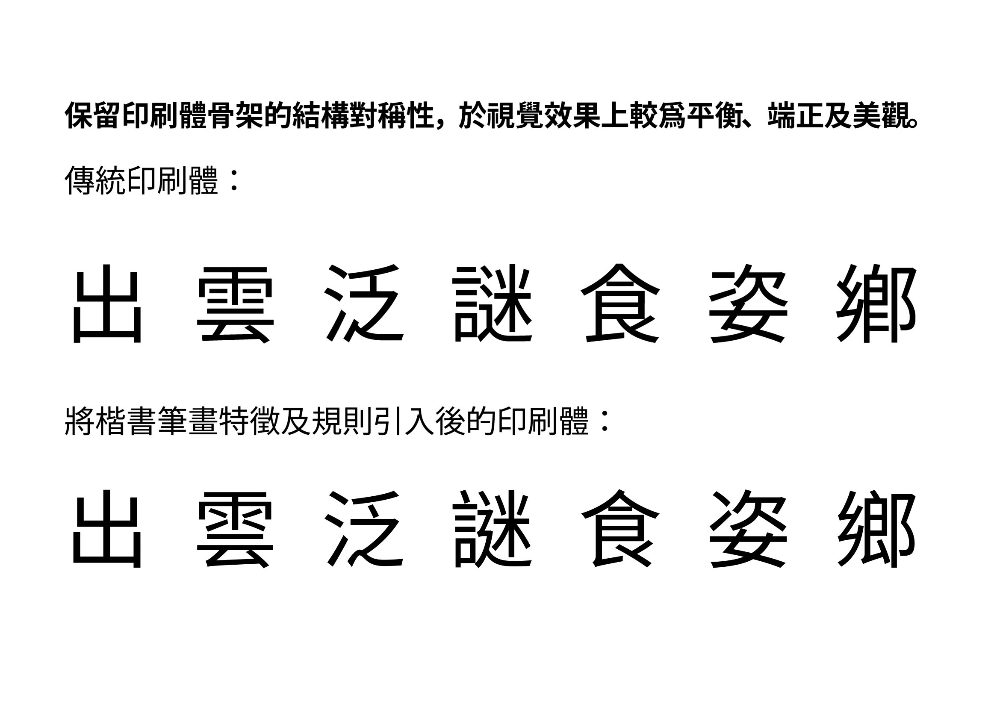
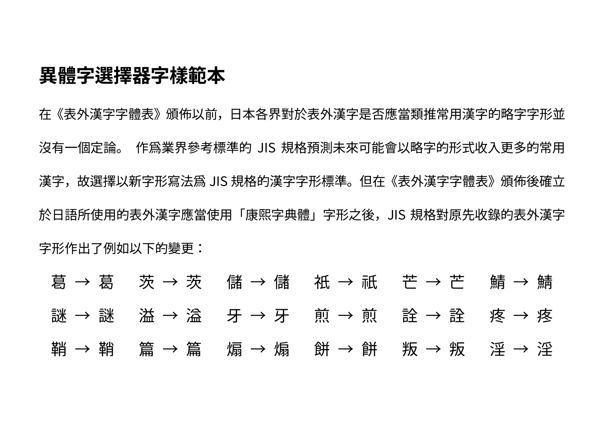
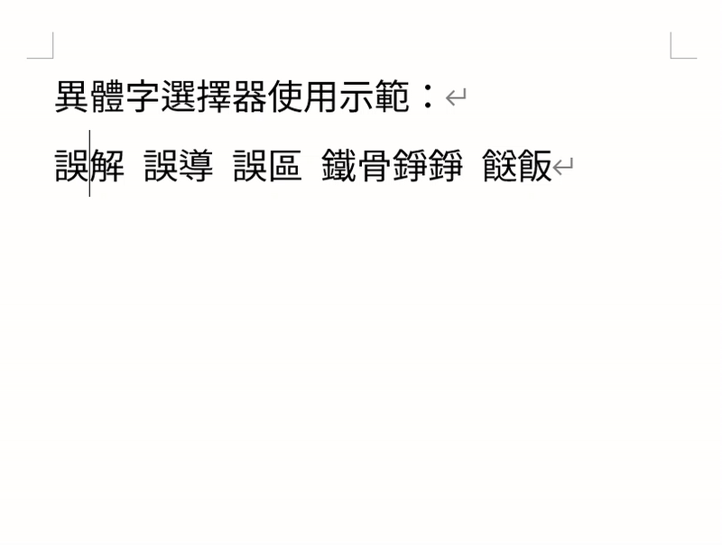
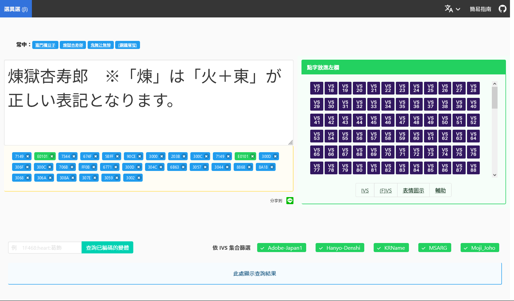
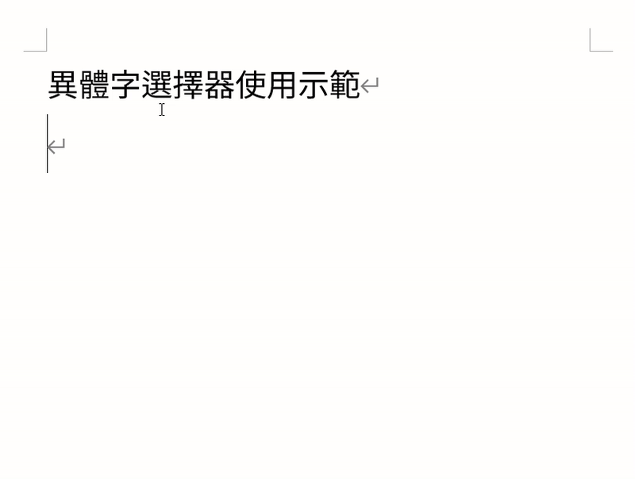

# ChiuKong Gothic 秋空黑體 秋空黑体 秋空ゴシック体

## 簡介
A Chinese language font family project derived from Source Han Sans, with the integration of Ideographic variation sequence.

一款基於思源黑體，同時整合異體字選擇器功能的中文印刷體風格字體家族專案。

## 分流版本
根據字圖映射所指定的默認字圖字形風格的不同，分爲以下兩個分流版本。

### 舊式印刷體字形版本（CL）
所使用的默認字圖字形爲各地漢字改革以前慣常使用的活字印刷字形，其字形選定基準大致與「いわゆる康煕字典体」相同。因簡化字修改進程仍未完善及簡化字用戶可能並不習慣舊字形考慮下，目前僅推薦於傳統漢字的場景下使用。

### 現代筆形印刷體字形版本（MN）
 所使用的默認字圖字形爲兼顧當代慣用筆形及保留印刷體骨架的新舊字形混合印刷體風格字形。如有兼顧簡化字使用場景的需求推薦使用該分流版本，但仍建議主要於傳統漢字的場景下使用。

> 註：無論是CL版還是MN版都可以利用字體整合的異體字選擇器功能選擇字符的其他字形，簡單來說卽使用MN版時亦可透過異體字選擇器指定CL版本默認字圖爲該字符的指定字形字樣。

> 註：作爲一款兼顧**純文本異體字排版特殊用途**的字體，於日常顯示用途或其他場景時可能會因「源規格分離原則」導致**風格不一致**的情況出現，請在具有需要統一風格的需求或不滿意部分字符的字形時多多善用本字體所整合的異體字選擇器功能、使用源規格分離分別編碼的字符或基於本專案進行進一步的改作。

## 特性及預覽

### 漢字印刷體風格
二戰後漢字圈各地因各種原因，基本上都在文字改革的浪潮中將手寫體及印刷體進行統一化處理，而其初衷乃以縮小其兩者之間的字形差異而減少在漢字敎學上產生的不便。在修訂參考字形方面多數的處理方式是將活字鉛字的慣用字形修改成貼合楷書慣用字形，而少數則是將手寫體向印刷體字形靠攏。
但與日本僅將字形調整爲傳統楷書字樣而保留傳統印刷體的筆畫處理方式不同的是，大中華地區各地在進行漢字改革時無一例外都有將楷書筆畫規則引入到印刷體當中，而其造成的影響是文本排版文字跳動感較大、字符重心不穩、可閱讀性差等諸多問題——而在衆多字形參考資料/標準當中以臺灣敎育部所訂立的「國字標準字體」最爲尤甚。

因此，在一些調整過後的參考字形並非强制性標準的地區中，出現了不少拒絕採納的聲音，以印刷界爲代表的各業界仍然繼續沿用原先的印刷體字形字樣。雖然今日不少字形爲了順應當代民衆的用字習慣而進行了調整，但大體上依舊保留着印刷體骨架而非參考字形那般將手寫體特徵無節制地套入到印刷體當中。
而選擇繼續使用帶有印刷體骨架的字形的字體而非根據標準使用楷化字形所帶來的好處是文本排版整齊，跳動感較少，文字辨識性較强，更加適合用於印刷場合及電子熒幕顯示等用途。

### 異體字選擇器
目前絕大部分面向中文使用者的字體基本都會指定其中的一個字形爲該字符的唯一字形，部分字符的字形可能並不是使用者所希望使用的字形，而且因各種原因普遍都不會搭載異體字選擇器這個已經普遍在日語字體實裝的功能。
這樣的做法是，在需要顯示單一字符的不同印刷體字形寫法的場合時亦顯得略微不便，這一不便在爲了風格整齊劃一而進行統一化處理的字體十分明顯——難以透過字形分辨不同編碼的字符，這對於希望可以透過使用或分辨「源規格分離原則」分別編碼的同字不同字形（或正俗字）字符需求中尤爲致命。
而卽便沒有進行統一化處理亦難以透過純文本的方式進行顯示某些統一編碼但印刷體當中有着不同字形的寫法，通常很多人在面臨類似的問題時多數會選擇搭配不同字體使用，但弊端較爲明顯的是無法在不支持多字體編排的場合中使用。

故本專案決定實裝已經在日語社區使用有一段時間的異體字選擇器，其將可以有效解決純文本異體字編排難的問題。卽透過這一功能使不用切換字體就可以達到在純文本的場景下同時顯示同編碼字符的不同字形，同時亦能透過使用異體字選擇器滿足部分使用者有對特定字符有指定字形的需求。

#### 異體字選擇器效果預覽

#### 使用方法

- **直接輸入變體選擇符**

	
	> *GIF中所演示的輸入方式爲直接輸入變體選擇符的其中之一的輸入方式，輸入完變體選擇符的Unicode編碼後使用Alt+X轉換成字符。*

- **使用「[異体字セレクタセレクタ](https://747.github.io/vsselector/)」網站**

	

	> *輸入本字體另外整合的字形時請選擇VS251 ~ VS256字符(U+E01EA ~ U+E01EF)*

- **使用支援異體字選擇器功能的輸入法（日語輸入法限定）**

	
	> *需要開啓「環境依存文字」功能*

#### 目前所支援的IVD字集

- Adobe-Japan1

- KRName

- 常用字範圍內的被使用的部分Hanyo-Denshi （泛用電子）集所定義的字形

- 常用字範圍內的被使用的部分Moji-Joho（MJ文字情報）集所定義的字形

- 部分被使用的MSARG（澳門特別行政區）集所定義的字形

- 常用字範圍內未收錄於任何IVD字集但認爲亦可整合的字形 （編碼區間：E01EA ~ E01EF）

#### 未來可能會支援的IVD字集

- 其他Hanyo-Denshi （泛用電子）集所定義的字形

- 其他Moji-Joho（MJ文字情報）集所定義的字形

- 其他MSARG（澳門特別行政區）集所定義的字形

- 其他未收錄於任何IVD字集但認爲亦可整合的字形 （編碼區間：E01EA ~ E01EF）

> 註：如以上計劃新增字集所定義的字形已和現有的字集重複（如部分Hanyo-Denshi與Adobe-Japan1的字形重複），將不重複編碼。
> 常用字定義：位於[秋明通用漢字表](https://glyphwiki.org/wiki/Group:chiuming-neko_cm-chara-list)範圍內的漢字。

## 著作權及授權信息
依照SIL Open Font License 1.1授權許可發佈，您可以：
- 可自由使用本字體，不限個人或商業用途。
- 自由分發本字体。
- 基於SIL Open Font License 1.1授權許可修改、二次創作本字体。

## 問題反饋
歡迎直接在Repo提交Issue反饋問題，一般而言僅受理於Repo提交的Issue。

原則上不受理提議要求統一源規格分離原則字符的Issue，原因是可能有違本專案有考慮兼顧純文本異體字編排的主旨。

## 鳴謝
- [思源黑體](https://github.com/adobe-fonts/source-han-sans) by Adobe
- [思源黑體 傳統](https://github.com/redchenjs/source-han-sans-classic) by [Jack Chen](https://github.com/redchenjs) 
- [源音黑體](https://github.com/MoneMizuno/Genne-Gothic) by [Huán-Syuān](https://github.com/MoneMizuno)
- [源樣黑體](https://github.com/ButTaiwan/genyog-font) by [But Ko](https://github.com/ButTaiwan)
- [傳承字形部件檢校表](https://github.com/ichitenfont/inheritedglyphs) 以及其代表字體 [一點明體](https://github.com/ichitenfont/I.Ming) by [一點字坊](https://github.com/ichitenfont)
- [滙文明朝体](https://zhuanlan.zhihu.com/p/344103391) by 特里王 
- [字統網](http://zi.tools)
- [康煕字典網上版](https://www.kangxizidian.com/)
- [東京築地活版製造所の活字見本帖](http://www.asahi-net.or.jp/~sd5a-ucd/Tsukiji-5go-S11-Specimenbook.html)
- [字形維基](https://glyphwiki.org/)
- [NightFurySL2001 ](https://github.com/NightFurySL2001) 的技術指導
